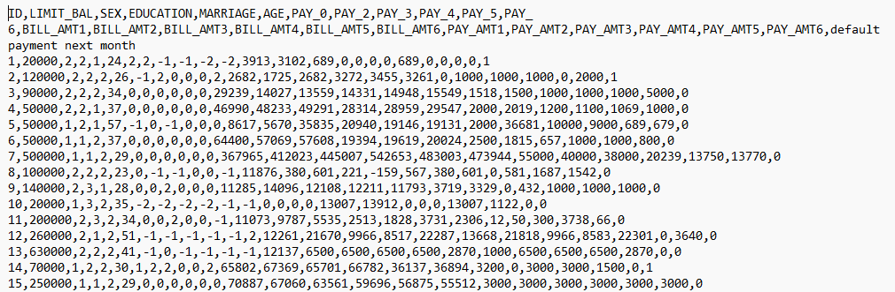
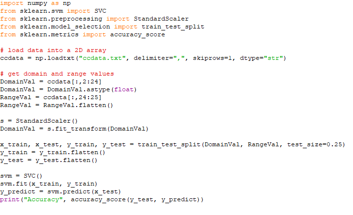
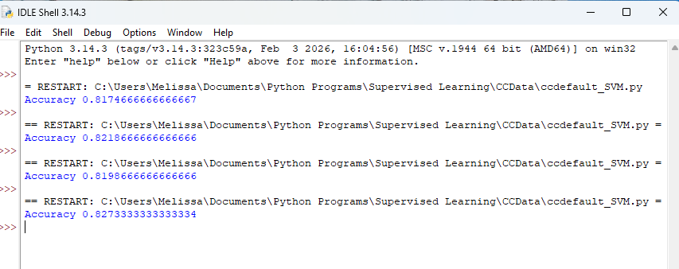

# Credit Default Prediction — SVM Model

## 📌 Overview
This project applies Support Vector Machines (SVM) to classify the likelihood of credit card default using structured customer data. The workflow focuses on transforming raw inputs into analytical features, training an optimized SVM classifier, and evaluating model performance to surface patterns in customer behavior and default risk.

---

## 🎯 Objectives
- **Develop a predictive model** that identifies customers at high risk of credit card default.
- **Analyze behavioral and financial indicators** to understand drivers of default.
- **Demonstrate a full machine‑learning workflow** from preprocessing to evaluation.

---

## 🛠️ Tech Stack
- **Language:** Python  
- **Libraries:** NumPy, scikit‑learn  
- **Tools:** GitHub for version control and documentation  

---

## 📂 Repository Structure
```text
Credit-Default-SVM
│── /code        # Python scripts for preprocessing, modeling, evaluation
│── /data        # CSV dataset
│── /visuals     # Model outputs, charts, and screenshots
│── README.md
```

---

# 📸 Dashboard Preview

## Customer Credit Data Sample


## SVM Model Training Code


## SVM Prediction Output


---

# 📥 How to Use
1. **Clone** or download this repository.
2. **Open** the project files in your Python environment.
3. **Edit** the ccdefault_SVM.py file to include the path to the ccdata file on your local machine.
3. **Run** the Python program to generate predictions and view outputs.
